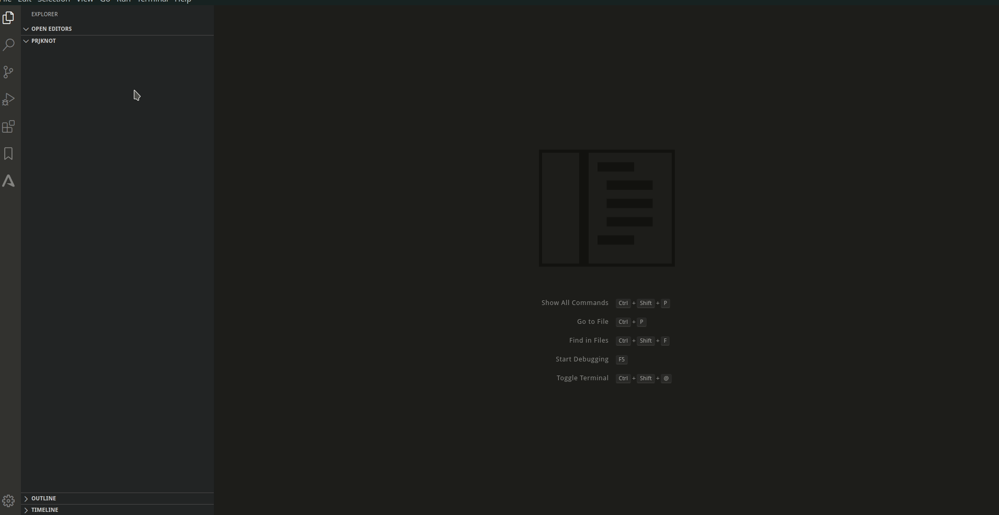

# knot-compiler

A compiler to convert knot definition schema in thing (zephyr, arduino) code

# How to generate parser
`antlr -Dlanguage=Go -o pkg/generated -package generated Knot.g4`

# Syntax

```
thing <ThingName> {
    sensor | actuator type label (unit in unitSystem) sends at ...;
}
```

The keyword `thing` can have many data items which can be a `sensor` or an `actuator`.

An actuator indicates that the value can be changed by an application over the internet

And a sensor cannot. Both of them `sends` data following a set of pattern as the user can define using the keywords:

`sends [each Xs] [at changes] [greater than X] [lower than X]` where X is a number value

# Example
If the user whats to control a LED it can define like this:



The user can label a sensor/actuator as a LED which sends a boolean value each 2 seconds. And also it represents a switch. Only boolean values can represent a switch. Any type different will generate a compiler error
